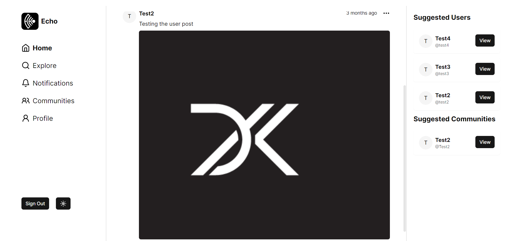
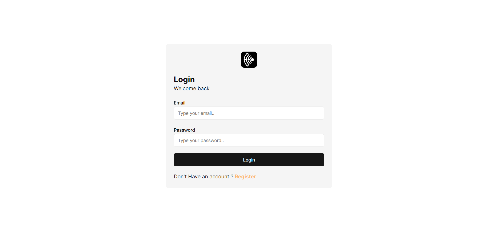
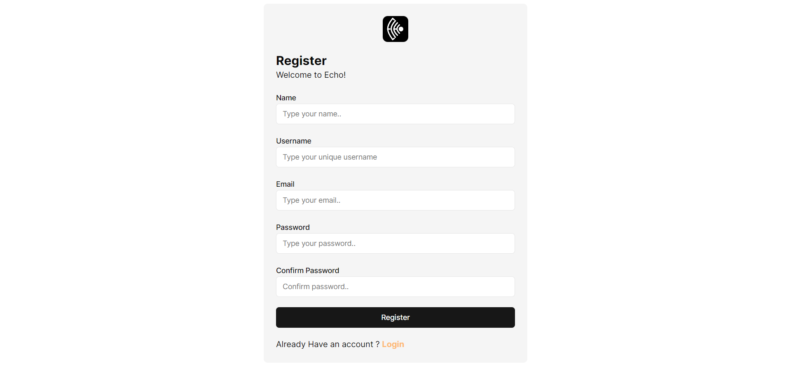
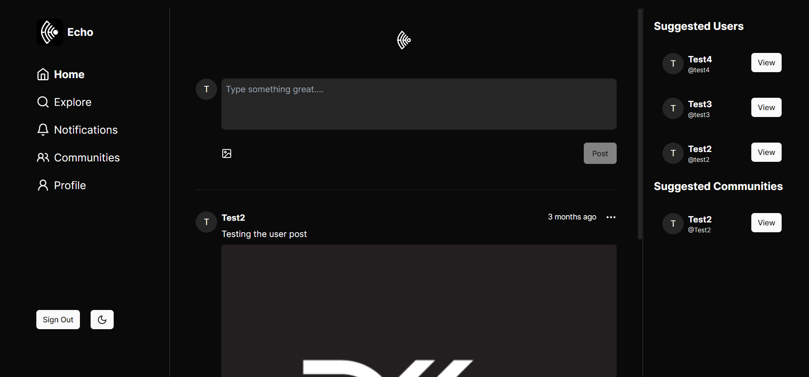
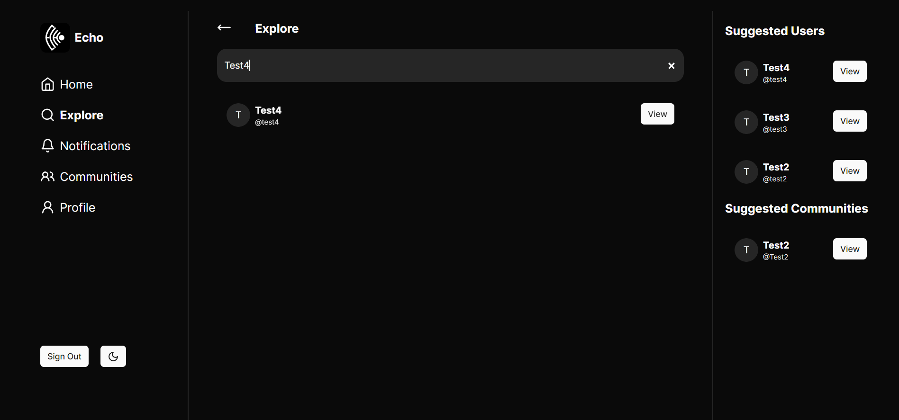
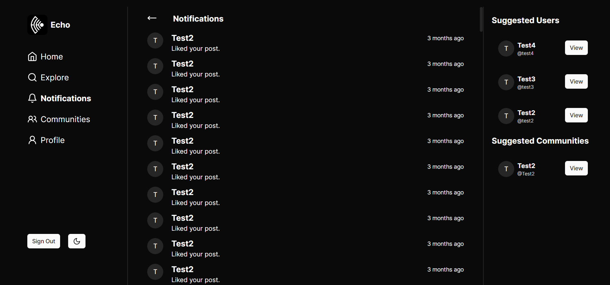
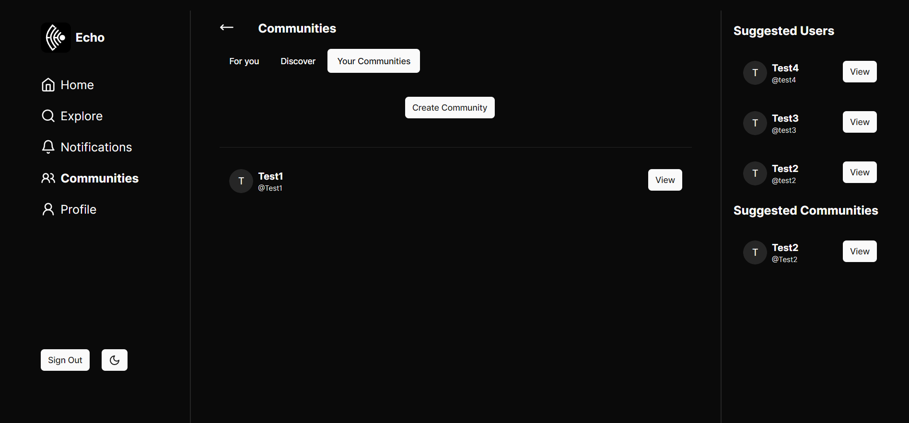
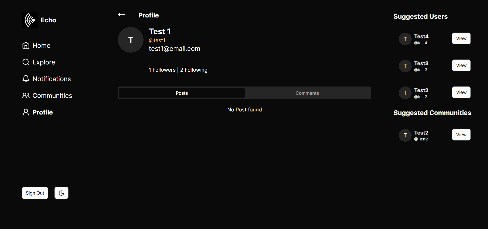

# ECHO

**Note: This project is currently in development and has not been deployed.**

## Overview

Welcome to our community-focused social media app project! This platform is designed to bring college communities together by providing a space for users to share thoughts, ideas, and engage in collaborative discussions. The app is built using Next.js, TypeScript, and Tailwind CSS to ensure a modern and responsive user experience.

## Features

1. **Community-Centric Development:**
   - Created with a strong focus on community building, fostering connections within college communities.

2. **Thoughtful User Authentication:**
   - Implemented secure user authentication using NextAuth and bcrypt.js, ensuring user data integrity and privacy.

3. **Tech Stack Optimization:**
   - Utilized a modern and efficient tech stack, including PostgreSQL, Prisma, and Zod, to optimize database operations and enhance data validation. Achieved a 35% reduction in query response times.

4. **Seamless User Experience:**
   - Engineered a seamless user experience with features like Home, Explore, Notifications, Communities, and Profile pages, fostering user engagement and interaction.

5. **Collaborative Community Building:**
   - Empowered users to share thoughts and ideas within dedicated communities, resulting in a 25% increase in active community participation.

6. **Performance-Driven Frontend:**
   - Developed the frontend using Next.js and Vine.js with a focus on performance optimization, resulting in a 20% improvement in page load times.

## Getting Started

### Prerequisites

- Node.js and npm installed
- PostgreSQL database

### Installation

1. Clone the repository.
2. Install dependencies: `npm install`
3. Set up the database: `npm run migrate`
4. Start the development server: `npm run dev`

## Screenshots

## Contributing

We welcome contributions! Feel free to open issues or pull requests.

## License

This project is licensed under the [MIT License](LICENSE).

## Note

When I wrote this code only God and I knew what I have written. Now Only God knows.
